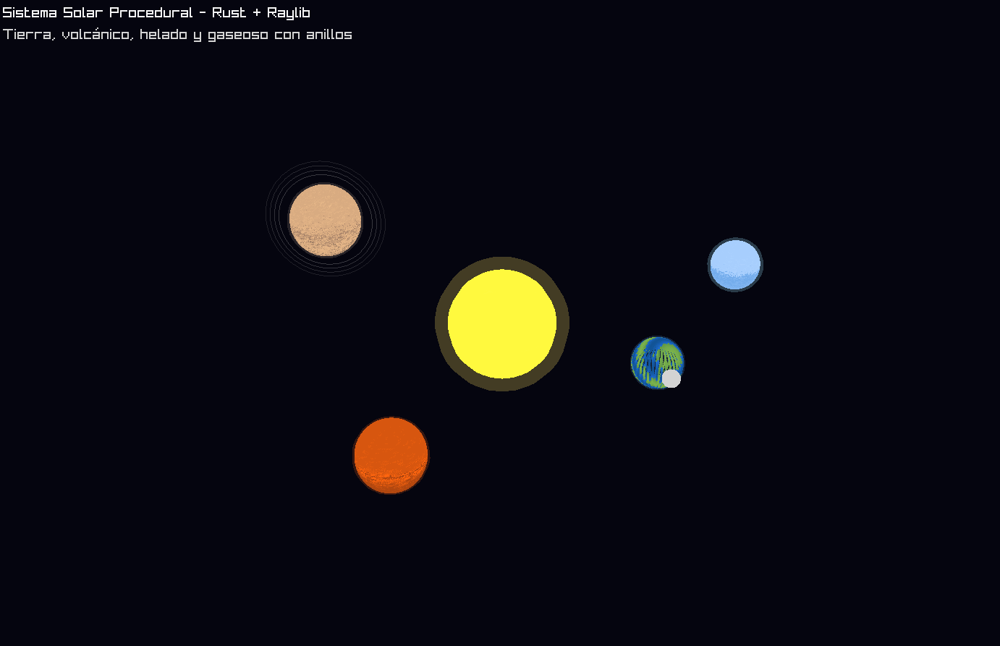

# 🌠 SpaceTravel - Laboratorio de Shaders

Este proyecto implementa un **sistema solar procedural** en **Rust + Raylib 5.5.1**, como parte del laboratorio de gráficos donde se practican **shaders por color** sin usar texturas ni materiales.

---

## 🪐 Cuerpos celestes

El programa renderiza un sistema solar con los siguientes cuerpos:

- ☀️ **Sol:** brillo pulsante y halo dorado con efecto de plasma.  
- 🌎 **Tierra:** mezcla de océanos, continentes y atmósfera azul.  
- 🌋 **Planeta volcánico:** tonos cálidos, superficie incandescente.  
- ❄️ **Planeta helado:** tonos azulados y capa de hielo brillante.  
- 🪐 **Gigante gaseoso:** bandas horizontales animadas y anillos translúcidos.  
- 🌙 **Luna:** satélite orbitando la Tierra.

Cada planeta se dibuja utilizando funciones procedurales (`draw_sphere`, `draw_sphere_ex`, `draw_circle_3D`) y variaciones en color, opacidad y movimiento.

---

## 🧠 Objetivo

Practicar la creación de **shaders basados únicamente en color y parámetros** ya disponibles, aplicando lógica matemática para generar variación visual sin texturas.

---

## 🖼️ Captura



---

## ⚙️ Ejecución

Requisitos:
- Rust y Cargo instalados  
- Dependencia principal: `raylib = "5.5.1"`

Para ejecutar:

```bash
cargo run 
